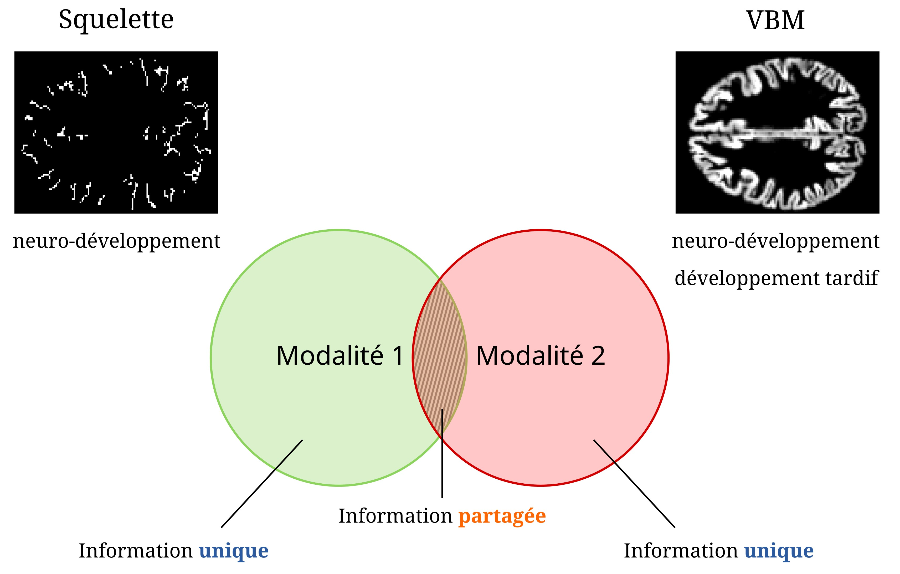
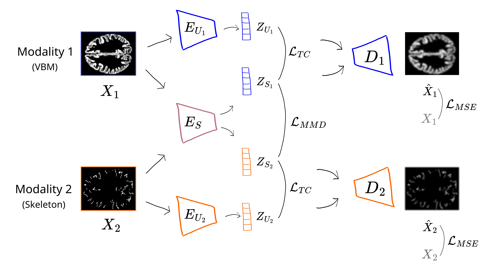
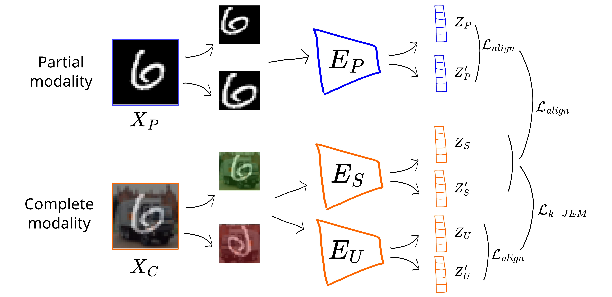

# Brain image disentangling

In this folder, we developped deep learning models to isolate the neurodevelopmental load of subjects from structural brain images. The method is to combine the skeletons, which capture neurodevelopmental information, with another brain features, which combine neurodevelopmental and late brain development information. From these two brain features, we aimed to exhibit the shared and unique information of each brain feature.

  
  
 General method for isolating the neurodevelopmental information from brain MRI.

In the [nss_prediction folder](./nss_prediction), we tried to predict the neurological soft sign (NSS) scores from brain features. The NSS scores are a scale that quantifies the neurodevelopmental load of subjects. We planned to use this scale to assess that our final model could effectively isolate neurodevelopmental load of patient from brain images.

These codes reproduce the experiments in Chapter 3 of my thesis manuscript.
___

## Methods

In this purpose, we developped two models:

* [vae_based](./vae_based): model designed from variational autoencoder (VAE)

* [cl_based](./cl_based): model designed from contrastive learning (CL)

## Datasets

We benchmarked the two proposed models on three synthetic datasets:
* [CIFAR](https://www.cs.toronto.edu/~kriz/cifar.html) - [MNIST](http://yann.lecun.com/exdb/mnist/)
* [Photo-Sketching](https://mtli.github.io/sketch/)
* [Morpho-MNIST](https://jmlr.org/papers/v20/19-033.html)

## Results

## Code

